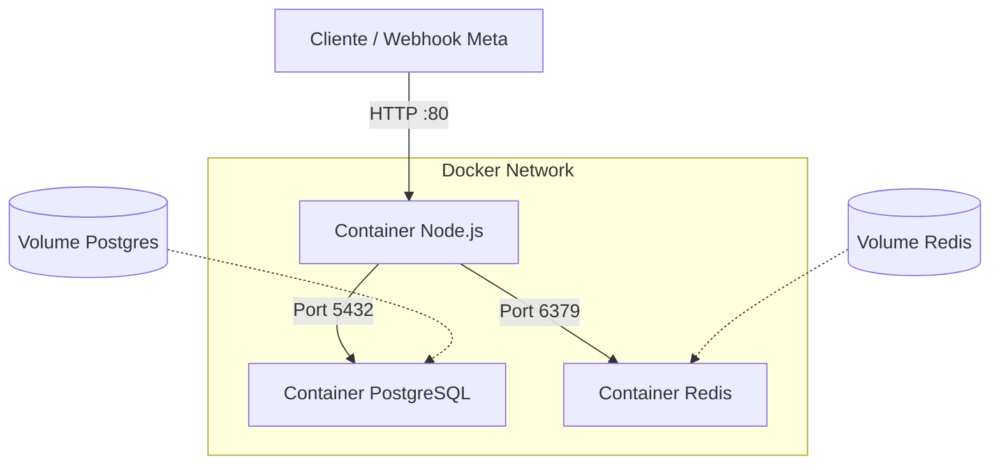

# Especificação de Infraestrutura Docker

Este documento detalha a arquitetura de containers para o ambiente de produção e desenvolvimento, garantindo isolamento, facilidade de deploy e escalabilidade.

## Visão Geral da Arquitetura

A aplicação será composta por três serviços principais orquestrados via Docker Compose:

1.  **Backend (App):** Node.js API.
2.  **Banco de Dados (DB):** PostgreSQL para persistência relacional.
3.  **Fila/Cache (Redis):** Gerenciamento de filas de processamento de Webhooks.



---

## Detalhamento dos Serviços (`services`)

### 1. `app` (Backend)
O coração da aplicação.
*   **Imagem Base:** `node:18-alpine` (Leve e segura).
*   **Contexto de Build:** `.` (Raiz do projeto).
*   **Comando:** `npm start` (Produção) ou `npm run dev` (Desenvolvimento com hot-reload).
*   **Portas:** Mapeia a porta interna (ex: 3000) para a porta 80 do host (ou outra definida).
*   **Dependências:** `depends_on` -> `db`, `redis` (Garante que a infra inicie antes da app).
*   **Variáveis de Ambiente:** Carregadas do `.env`.

### 2. `db` (Banco de Dados)
Persistência segura dos dados.
*   **Imagem:** `postgres:15-alpine`.
*   **Portas:** Exposta apenas internamente na rede Docker (segurança), ou mapeada para localhost em dev (ex: `5432:5432`).
*   **Variáveis de Ambiente Necessárias:**
    *   `POSTGRES_USER`
    *   `POSTGRES_PASSWORD`
    *   `POSTGRES_DB`
*   **Volumes:** Persistência de dados essencial para não perder informações ao reiniciar o container.

### 3. `redis` (Fila)
Essencial para processamento assíncrono de webhooks.
*   **Imagem:** `redis:7-alpine`.
*   **Comando:** `redis-server --appendonly yes` (Para persistência básica em caso de falha).
*   **Portas:** Exposta internamente (6379).
*   **Volumes:** Opcional, mas recomendado para persistência de filas não processadas (`redis_data`).

---

## Volumes e Redes

### Volumes
Para garantir que os dados sobrevivam ao ciclo de vida dos containers:
1.  `postgres_data`: Montado em `/var/lib/postgresql/data` no serviço `db`.
2.  `redis_data`: Montado em `/data` no serviço `redis`.

### Redes
Uma rede interna (`driver: bridge`) chamada `app-network` será criada para permitir que os containers conversem entre si usando seus nomes de serviço como hostname (ex: a app conecta no banco usando o host `db` em vez de um IP).

---

## Exemplo de Configuração (`docker-compose.yml`)

Esta é a estrutura base que será implementada:

```yaml
version: '3.8'

services:
  app:
    build: .
    container_name: leads_app
    restart: always
    ports:
      - "${PORT:-3000}:3000"
    environment:
      - DATABASE_URL=postgresql://${POSTGRES_USER}:${POSTGRES_PASSWORD}@db:5432/${POSTGRES_DB}
      - REDIS_HOST=redis
      - REDIS_PORT=6379
    depends_on:
      - db
      - redis
    networks:
      - app-network

  db:
    image: postgres:15-alpine
    container_name: leads_db
    restart: always
    environment:
      POSTGRES_USER: ${POSTGRES_USER}
      POSTGRES_PASSWORD: ${POSTGRES_PASSWORD}
      POSTGRES_DB: ${POSTGRES_DB}
    volumes:
      - postgres_data:/var/lib/postgresql/data
    networks:
      - app-network

  redis:
    image: redis:7-alpine
    container_name: leads_redis
    restart: always
    command: redis-server --appendonly yes
    volumes:
      - redis_data:/data
    networks:
      - app-network

volumes:
  postgres_data:
  redis_data:

networks:
  app-network:
    driver: bridge